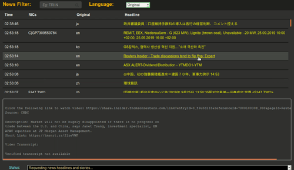

# 显示实时翻译标题的新闻监测 
## 目录

* [概览](#overview)
* [免责声明](#disclaimer)
* [先决条件](#prerequisites)
* [包](#package)
* [运行新闻监测](#monitor)

## <a id="overview"></a>Overview
实时新闻小组件是一个基于 web 的轻量接口，利用 Elektron RealTime (ERT) 实时服务内提供的功能，向浏览器提供实时新闻标题和报道。本版本为对 Nick Zincone 原始的 [Real-time news widget](https://github.com/Refinitiv-API-Samples/Example.WebSocketAPI.Javascript.NewsMonitor) 进行了修改的版本，用以说明创建显示实时翻译标题的新闻监测易于实现。它使用了 Google 的商用 API 进行了机器翻译，但可使用任何其他机器翻译供应商的 API 进行替代。

有关详情和概念，可参见 Developer Community 门户中的 [Real-time News Monitor using Refinitiv Elektron](https://developers.refinitiv.com/content/creating-real-time-news-monitor-app-mrn-and-elektron-websocket-api) 视频。



若对本文有任何问题或建议，请使用 Developer Community [Q&A Forum](https://community.developers.refinitiv.com)。

***注:** 为能在 [Developer Community portal](https://community.developers.refinitiv.com) 上提问并畅享其资源，建议先 [在此注册]( https://developers.thomsonreuters.com/iam/register) 或 [登录]( https://developers.thomsonreuters.com/iam/login?destination_path=Lw%3D%3D)。*

## <a id="disclaimer"></a>免责声明
Refinitiv 在此提供此项目源代码的唯一目的是用于说明创建简单的显示实时翻译标题的新闻监测的概念。本代码**不适用于生产环境** (尤其其翻译 API 是从客户端访问的)。 

## <a id="prerequisites"></a>先决条件

使用的软件组件和 API:

* [Elektron WebSocket API](https://developers.thomsonreuters.com/elektron/websocket-api-early-access) - 访问 Elektron 实时市场数据的接口。
* [Angular JS](https://angularjs.org/) (v1.6.5)- Googles 客户端 JavaScript 框架，用于生成功能丰富的 HTML 应用。它不仅可简单直观地在页面内呈现内容，还可提供动画的视觉反馈以提醒存在实时更新。
* [Bootstrap](http://getbootstrap.com/css/) (v3.3.7) - CSS 模板，提供用于显示的有用样式。 
* 访问 ERT 实时服务。
* [Google Translate API](https://cloud.google.com/translate/) 使用 Google 经训练的机器学习模型或基于内容需要的定制模型在语言间动态翻译。

浏览器支持: 

- [任何浏览器](https://kangax.github.io/compat-table/es6/) ，只要其支持 [ES2015 specification](https://en.wikipedia.org/wiki/ECMAScript#6th_Edition_-_ECMAScript_2015) 

## <a id="package"></a>包

本包包含完整的源代码和执行的必要依赖项。如需必要的连接和测试设置帮助，可联系本地的市场数据团队或 Refinitiv 代表。 因为包包含了 [ERTController](https://github.com/TR-API-Samples/Example.ERT.Javascript.ERTController) 子模块，需要使用以下命令适当克隆:

`git clone --recursive <URL of this package>`

还需要 Google 提供的 API 密钥，需要付费。 [Google Translation API](https://cloud.google.com/translate/docs/quickstarts)

应用包包含以下内容:

- **ERTController/ERTWebSocketController.js**

- **ERTController/ERTRESTController.js**

  通用接口，用于管理平台身份验证和与 Elektron RealTime (ERT) 服务的所有通信。 有关详情，请参见 [Example.ERT.Javascript.ERTController](https://github.com/TR-API-Samples/Example.ERT.Javascript.ERTController) 项目。

- **newsObject.html, newsObject.js**

  HTML/JavaScript 使用 Angular JS 框架生成小组件..

- **css / fonts / js**

  支持技术: Angular JS, Bootstrap.

## <a id="running"></a>运行小组件

新闻监测应用提供访问 ERT 实时服务的功能，该服务可通过本地部署的 TREP 环境 Elektron Data Platform (EDP) 提供，或在今后可通过 Eikon Desktop 提供。 在配置特定身份验证属性之前，首先需要让小组件指向配置，以确定访问方式。  

在 *newsObject.js* 文件内选择会话:

```javascript
// Application session configuration
// Define the session (TREP, EDP/ERT) you wish to use to access streaming services.  
// To define your session, update the following setting:
//      session: undefined
//
// Eg:  session: 'EDP'     // EDP/ERT Session
//      session: 'ADS'     // TREP/ADS Session
app.constant('config', {
   session: undefined,         // 'ADS' or 'EDP'.
```

指定会话之后，请参见以下的各部分，它们概述了在浏览器中设置和运行小组件的必需步骤。

**注**: 为使 *Eikon* 内可访问 ERT 实时服务，需 Eikon desktop 内发布并支持此服务..

### TREP/ADS

要设置对本地部署的 TREP 环境的访问，需在 *newsObject.js* 文件内提供服务器和身份验证详情。在代码部分定义您的属性:

```javascript
// TREP (ADS) session.
// This section defines the connection and authentication requirements to connect
// directly into the streaming services from your locally installed TREP installation.
// Load this example directly within your browswer.
adsSession: {
   wsServer: 'ewa',    // Address of our ADS Elektron WebSocket server.  Eg: 'elektron'
   wsPort: '15000',    // Address port of our ADS Elektron Websccket server. Eg: 15000
   wsLogin: {          // Elektron WebSocket login credentials
      user: 'user',              // User name.  Optional.  Default: desktop login.
      appId: '256',              // AppID. Optional.  Default: '256'
      position: '127.0.0.1',     // Position.  Optional. Default: '127.0.0.1'         
   }             
},
```

要运行小组件, 只需在浏览器内加载文件。

### EDP/ERT

从您的浏览器连接到云将需要在本地代理内运行 JavaScript。 浏览器强制执行 [***Same-origin***](https://developer.mozilla.org/en-US/docs/Web/Security/Same-origin_policy) 政策，这是减少恶意攻击的关键安全机制。   

要设置您的环境在云中访问 ERT, 请执行以下步骤:

1. 在安装目录内, 通过执行以下命令安装 [Node.js](https://nodejs.org/en/) 模块。  

   **注**: Node.js 必须安装在计算机上。

   ```
   $> npm install
   ```

   这将创建一个称为 node_modules/ 的本地目录，它包含运行本地 HTTP 服务器的模块。

2. 配置特定示例内的访问，请参见代码部分，它需要身份验证详情:

   ```javascript
   // ERT (Elektron Real Time) in Cloud session.
   // This section defines authenticastion to access EDP (Elektron Data Platform)/ERT.
   // Start the local HTTP server (provided) and within your browser, specify the 
   // URL: http://localhost:8080/quoteObject.html
   edpSession: {
       wsLogin: {
           user: undefined,
           password: undefined,
           clientId: undefined
       } 
   ```

3. 配置 Google 翻译 API 的 API 访问密钥。newsObject.js 的行 130:

   ```
        // Enter an API key from the Google API Console:
        //   https://console.developers.google.com/apis/credentials
        const apiKey = "enter key here";
   ```

4. 启动服务器

   ```
   $> node server.js
   ```

   这将启动在端口 8080 上运行的本地 HTTP 服务器。

   **注**: 如果计算机位于代理服务器之后，则需要配置 Node.js 使用代理，而不是直接访问 HTTP 连接。这通过在命令提示中运行以下命令配置:

   ```
   set https_proxy=http://<proxy.server>:<port>
   ```

5. 使用以下 URL 格式在浏览器内加载小组件:

   ```
   http://localhost:8080/newsObject.html
   ```

### Refinitiv Workspace (今后)

### <a id="contributing"></a>Contributing

有关提交请求的准则和流程的详情，请参见 [CONTRIBUTING.md](https://gist.github.com/PurpleBooth/b24679402957c63ec426)。

### <a id="authors"></a>作者

* **Nick Zincone**   - 版本 1.0.  *原始版本* (仅 TREP 连接)
* **Nick Zincone**   - 版本 2.0.  添加了在云中连接 EDP/ERT。
* **James Sullivan** - 版本 3.0.  添加了实时标题的机器翻译。

### <a id="license"></a>许可证

本项目遵照 MIT 许可证提供许可 - 有关详情，请参见 [LICENSE.md](LICENSE.md) 文件
